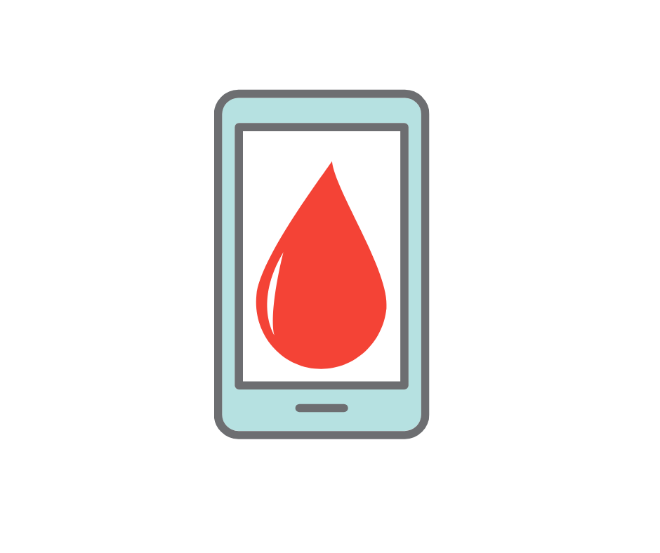

 

    
    <h3 align="center">Blood Bank</h3>
     
    

      All-in-one portal for Blood Donation 🩸
       
       
      <a href="https://github.com/debdutgoswami/blood-bank/issues/new">Report Bug</a>
      ·
      <a href="https://github.com/debdutgoswami/blood-bank/issues/new">Request Feature</a>
    

# Blood Bank

This project contains the APIs built for `HACKNPITCH`, a hackathon conducted by `Jadavpur University`. We worked on the `Blood Bank` problem statement.

---

## Technologies used

1. Flask

2. React

3. [Flutter](https://github.com/flametron/Delhihacks-Bloodbankapp) 

4. Google Cloud Platform (GCP)

5. Django (added later, has the same functionalities)

---

## UPDATE

The entire code is later on refactored and implemented using `Django Rest Framework (DRF)`
The previous flask code is moved into `flask` folder.
